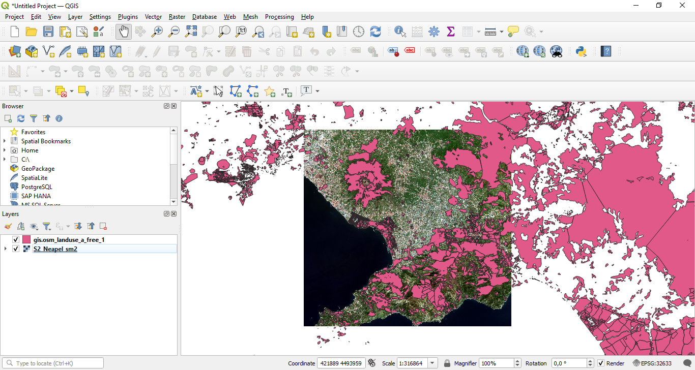
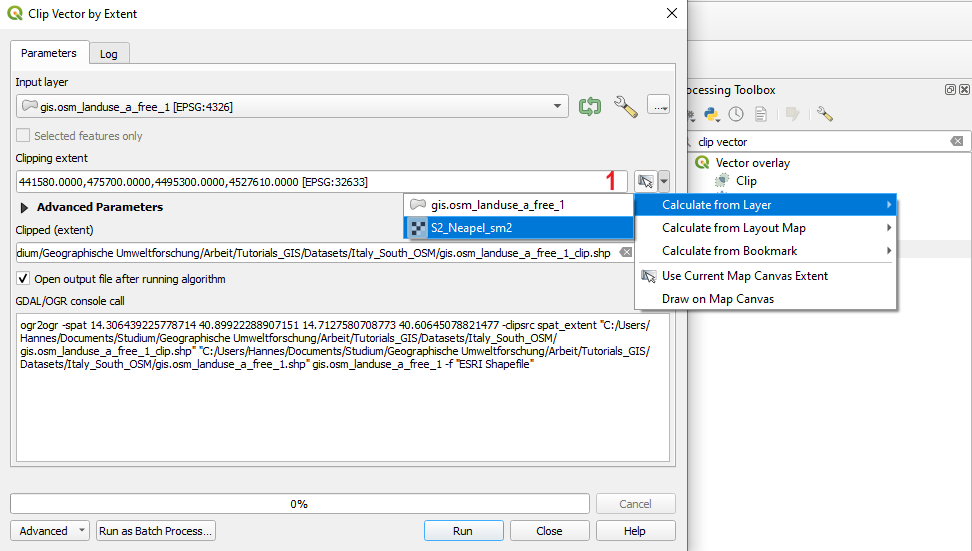
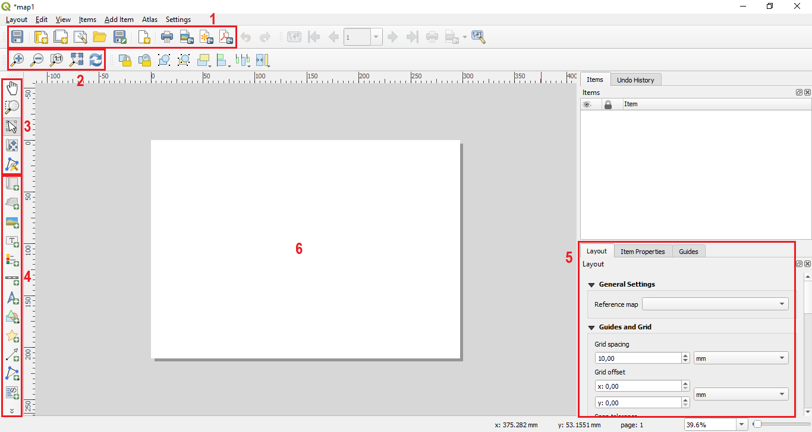
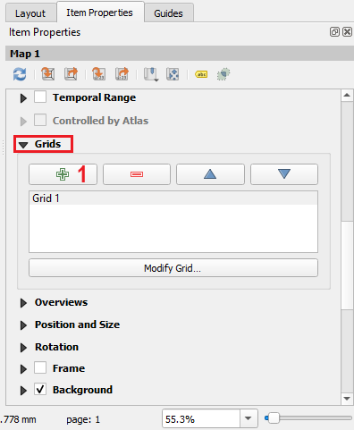
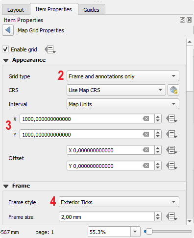
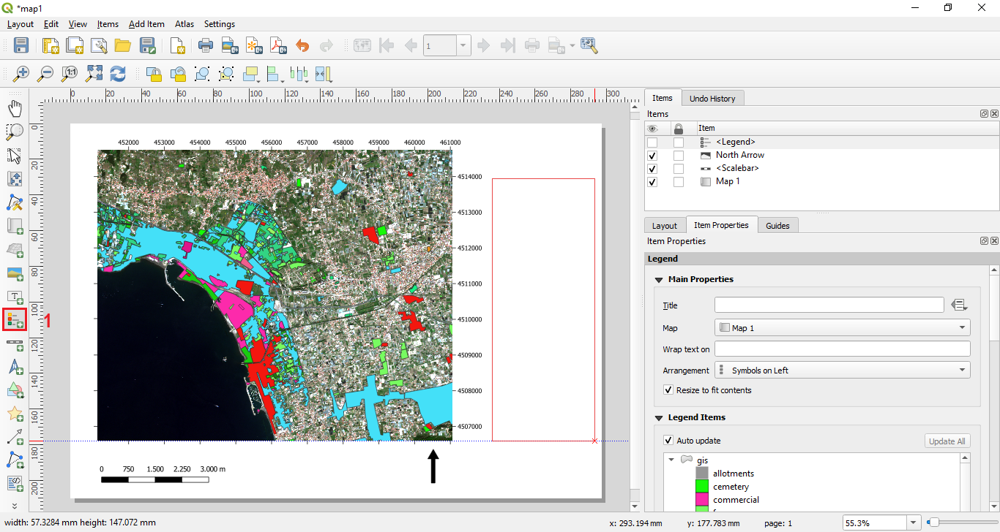
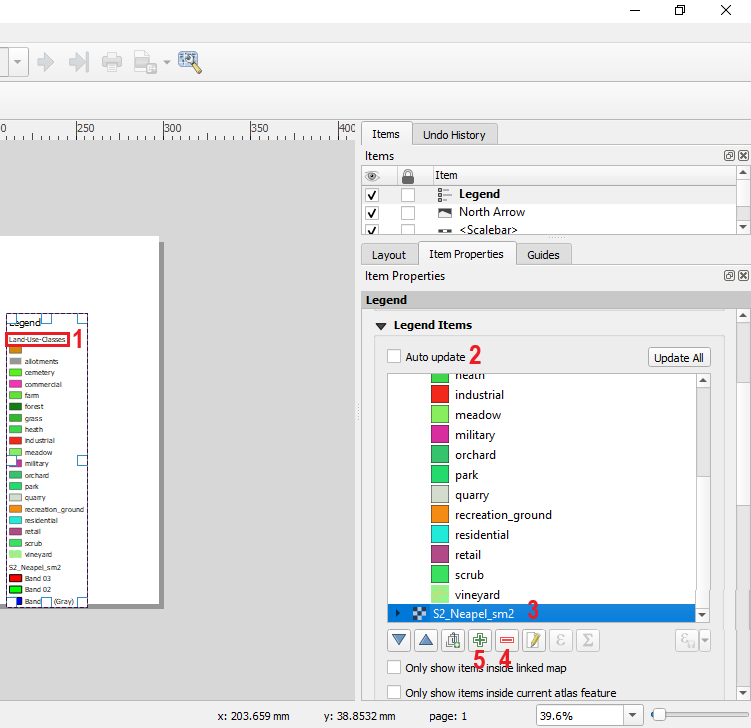

# QGIS - Tutorials 
## Tutorial 8 - Making a map in QGIS

**Abstract**

After completing this tutorial you will know how to create basic maps in QGIS with an appropriate legend, a north arrow, a coordinate grid and a scale. Developed with QGIS version - Bialowieza 3.22.5

## 1 Preparing the data for the map: Reprojecting and cutting a Shapefile to a desired extent
In this tutorial we will learn how to create basic maps in QGIS. As a first step

**we again first load the raster dataset “S2_Neapel_sm2.tif” and adapt the visualization settings to have a balanced view of all classes by using the channels R=3, G=2, B=1 and loading new max / min values using the “Symbology”- tab in the properties window. Then we additionally load the “gis.osm_landuse_a_free_1” layer provided in one of the earlier tutorials.**

This will lead to the situation shown in Figure 1.

**Figure 1: The two loaded datasets.**

For creating the map, we would like the applied datasets to cover the same extent. So as next step, we will clip the Shapefile so that its extent matches the extent of the satellite image. To accomplish this, we will 

**select “Processing” -> “Toolbox” from the main menu in QGIS to open the Processing Toolbox window (in case it is not already open). Then we will type “clip vector” into the search field of the Processing Toolbox window (marked with “1” in Figure 2) and select the tool “clip vectors by extent” as marked with “2“ in Figure 2. In the new dialogue, we select “gis.osm_landuse_a_free_1” layer as input layer and then press the “...” button marked with “1” in Figure 3. This will open a another menu from which we select the first option “Calculate from Layer”. In the newly opened window, we then select the satellite image “S2_Neapel_sm2 [EPSG:32633]”. We define an output file and click "Run".**

**Figure 2: Loading the clip vector tool from the Processing toolbox.**

**Figure 3: Calculating the clip extent from a layer.**

After re–arranging the layers to put the clipped Shapefile on top of the other layers, the main visualization window of QGIS should look as shown in Figure 4. The colours are of course likely to differ. In Figure 7 we can now see that the Shapefile was clipped to the extent of the satellite image.

**Figure 4: The clipped Shapefile on top of the satellite image.**

Be aware that the land-cover layer at the moment is still in the geographic coordinate system (EPSG code: 4326). While this is not absolutely problematic in this tutorial since QGIS is able to reproject the file "on-the-fly" you can still reproject the vector layer to UTM if you prefer to have all data in the same coordinate reference system. You should already be familiar with this process from the last tutorial.

## 2 Preparing the data for the map: Adapting the visualization settings of the Shapefile

As a next step, we have to prepare all the contents and visualization settings that we would like to integrate into our final map. In our case, we will display only the clipped and re–projected Shapefile as main information source to create a land–cover map and use the satellite image in the background. As next steps, we will therefore adapt the visualization settings of the Shapefile by selecting a categorized visualization setting in the “Symbology” tab of the “Properties dialogue”. We then manually adapt the colour of all land–use classes so that they reasonably well match their meaning. For example, it might be a good idea to assign a green colour to vegetation classes. The basic process to accomplish this should already be known from Tutorial 2.

So, as a next step, try to adapt the visualization settings of the Shapefile in a way that the main visualization window of QGIS looks similar as seen in Figure 5.

**Figure 5: Situation after adaping the visualization options of the Shapefile containing the land–use–classes.**

## 3 Starting the print composer dialogue

**Figure 6: Opening the print composer dialogue.**

We are now ready to initiate the preparation of a map. In QGIS all functions to create a map are hidden in the “print Layout”-Tool which can be accessed from the main menu of QGIS. We will now try this by

**selecting “Project” -> “New Print Layout...” from the main menu of QGIS as illustrated in Figure 9. This will first open a pop–up window (Figure 7) which will ask you for the name of your new map. We will enter “map1” here and confirm by clicking “OK”. This will open a new window depicting a completely new graphical user interface as shown in Figure 8.**

**Figure 7: Entering a name for the new print layout project/map.**

**Figure 8: Overview over the print composer user interface.**

This new graphical user interface provides all functionalities to compose a map based on the geodata displayed in the QGIS project. In Figure 8 an overview over the main sections of the print composer tool is given.

The area marked with **“1”** provides general tools to start composing a new map, store or duplicate a current map project and save a current project as a template. Furthermore, some options to export the current display to a file are provided.

The tools in the area marked with **“2”** allow to refresh the current contents displayed in the map and to zoom within the map itself (not in the map contents).

The tools marked with **“3”** allow to navigate and adapt the extent of the displayed map contents.

The tools marked with **“4”** allow to add items to the map including for example a North arrow, the current geodata displayed in the main visualization window of QGIS, a legend, etc.

The section marked with **“5”** provides additional information for all items that are currently included in the map composer project. To access the options of a item, the item has to selected in the main visualization area of the print composer tool (white area marked with **“6”**).

## 4 Adding items to the map

We will now start composing our map by first of all adding the current visualization of the QGIS project to the map. We will do this by

**selecting the “add map” button marked with “1” in Figure 9 and then drawing a rectangle in the main visualization area of the map composer tool as shown in Figure 12.**

**Figure 9: Adding a map to the print composer view.**

This will add the current QGIS project visualization to the map as shown in Figure 10. This map item can now be seen as a “placeholder” that will always show the current visualization of the QGIS project if the view is updated. It will not update itself automatically. In Figure 13 you can see that the actual map content is not fully filling out the frame of the map–item we have just created. We can address this problem by on the one hand side moving the map contents within the map–item frame by using the tool marked with “1” in Figure 10 and on the other hand by adapting the current scale of the map. This can be achieved by first selecting the map–item in the main visualization window and then selecting the “item properties” tab as marked with “2” in Figure 10. Then we can change the scale by changing the number given in the field marked with “4”. The smaller we make this number, the more we will zoom into the map. We can try this by

**changing the current value of around 137.000 to 50.000. After changing the value we have to press the “Update preview” button marked with “3” in Figure 13 to refresh the current view of the map.**

**Figure 10: Adapting the displayed extent of the geodata in the print composer view**

The **“Update preview”** button has is a quite important tool. You will have to use it always if you change something in the map contents. That is, if you decide to activate or deactivate some of your geodata in the main visualization window of QGIS and you want to see this also in the print–composer view, you will always have to use the “Update preview” button.

The situation after changing the scale to 50.000 is shown in Figure 11. You can see that, as expected, the displayed extent has shrinked notably, but at the same time, the level of detail has increased.

**Figure 11: Situation after adapting the scale of the map**

As next step, we will add a grid displaying the coordinates of the map. To do this,

**we again first select the map–item in the main visualization window of the map composer, then select the item properties tab as before to change the scale of the map–item. Here, we will scroll down a bit until we reach the section “Grids” marked with the red frame in Figure 12. We open the section and first of all press the green + button (marked with “1” in Figure 12) to add a grid. We can then adapt the properties of the grid by clicking the "Modify Grid" button (marked with "2" in Figure 12). In the situation shown in Figure 13 we selected “Frame and annotations only“ as “Grid type”. This is a rather discreet solution as the grid is only depicted outside of the map. You can play around some more with the differing grid types and see which one you prefer. Furthermore, it is important to select the interval at which grid cells or annotations are set. In the given example the x and y intervals were set to 1000 map units, with map units being meter (area marked with “3” in Figure 13). Please be aware that the map units are only meters if the CRS of the project is set to EPSG 32633 (the crs of the Sentinel-2 image). If the project CRS is currently set to EPSG 4326, you might not see a grid at all since then 1000 as interval would mean 1000° and hence there would no coordinate marked at all since the geographic coordinates only range from 0 to 180 degrees. If this would be the case for you, you can adapt the CRS in the map view by clicking the button marked with "5" in Figure 13. The frame style can be adapted using the area marked with “4”.**

**Figure 12: Adding a grid and drawing coordinates around the map.**

**Figure 13: Adding a grid and drawing coordinates around the map.**

To get a feeling for the multitude of available settings, it is best to play around with the different grid types and frame styles and just have a look how the displayed map changes. What is still missing in your map, are the coordinate themselves. To add these, you have to scroll down a bit further in the “Item properties” tab. Then you will find the option to activate the “Draw coordinates” check–box as marked with “1” in Figure 16. In the same section you will find options to activate and de–activate the coordinates for certain sides of the map (area marked with “2” in Figure 16). Generally, it is sufficient to draw the coordinates for one x and one y axis. Further down, it is possible to define the precision of the coordinate. While it makes sense to give precision with decimals for example when using a geographic coordinate system with latitude and longitude values, it in most cases does not make sense in metric coordinate systems such as UTM as most maps will typically not be resolved in sub-meter resolutions. In the example, the value was therefore set to 0.

**Figure 14: Parameterizing the displayed coordinates**

Next, we will add a North arrow and a scale bar to our map. We can do this by

**selecting the buttons marked with “1” and “2” in Figure 15. Simply click on of the button and then click within the main visualization section of the print composer. You can later adapt the properties of the North arrow and the scale bar by selecting them and adapting the settings displayed in the “Item Properties” section as done before for the map–item.**

**Figure 15: Adding a North arrow and a scale bar.**

Please be aware, that the North arrow in QGIS is not connected to the geoinformation contained in the data. It basically is just a grapical arrow that you draw in any direction. So please make sure that you use it appropriately.

## 5 Adding a Legend to the map

We will now have a closer look on how to add and adapt a legend to our map. For adding the legend

**we select the “add legend” button marked with “1” in Figure 16 and then draw a rectangle at the position where we want to locate the Legend as shown in Figure 16.**

**Figure 16: Adding a legend.**

This will lead to the situation shown in Figure 17. As you can see, the basic version of the Legend already looks quite suitable. Nevertheless, we might want to adapt a few points related to the displayed contents and the design. For example, we can see that at the bottom of the legend, there is an extra entry for the satellite image stating “S2_neapel_sm2”. This is not really very informative for a potential user of the map. Furthermore, the sub-title of the Legend currently reads “Clipped (extent)” which also should be changed to a more meaningful information.

**Figure 17: After adding the legend.**

We will now address these two points by

**first selecting the legend in the main visualization window and then opening the “Item properties” tab. Then we scroll down to the entry “Legend items” marked with “1” in Figure 18. Here we will first of all change the name of the section showing the land–use–classes which is currently named “Clipped extent” (it might differ in your case). We do this by double–clicking the field marked with “2” in Figure 18, this will open die pop–up window marked with “3”. Here, we will now change the title to “Land–use–classes” and confirm with “OK”.**

**Figure 19: Adapting sub–headings in the legend.**

In Figure 21 you can see that the sub-heading has now changed from “Clipped (extent)” to “Land–Use–Classes” (see red box marked with “1”). Next, we will delete the entry in the legend that was created for the satellite data. To do this, we

**first uncheck the option “Auto update” as marked with “2” in Figure 19. If the “Auto update” function is activated, the legend will always display the legend entries for all layers currently activated in the QGIS project. For manually adapting the legend, it has to be de–activated. Next, we select the entry “S2_Neapel_sm2” (marked with “3”) and then we press the red minus button marked with “4” to drop the corresponding entry from the legend.**

In the same way, you could also manually add an entry to the legend by clicking the plus button marked with “5” which will then open a pop–up window with all all available layers that are currently not included in the Legend. If you scroll a bit further down in the “Item properties” window you will see that there are many further options to adapt the layout of the Legend. You can change the font type, the font size and in how many Columns the legend entries are arranged. Feel free to play around with these options and have a look how they affect the layout of your Legend.

**Figure 19: Dropping and adding items from the Legend.**

## 6 Finalizing the map

We now have a map with the most important properties present. We will now finalize the map by adding some information on the data source, a title, and the applied coordinate reference system. To add a title we will

**use the “Add new label” button marked with “3” in Figure 20. Then we can change the displayed text in the field marked with “1” and increase the font size by clicking the button marked with “2”. After re–arranging the text a bit in the main visualization window, we can reach a situation similar as shown in Figure 20.**

**Figure 20: Adding a title to the map**

We can now add in the same way the data source and the applied coordinate reference system. There is currently no option in QGIS to do this automatically. You can try to accomplish this on your own to create a map that looks similar as shown in Figure 23.

**Figure 21: The final map.**

## 7 Exporting the map
If we are happy with the layout of our map we can now export the map by

**either selecting “Layout” -> “Export as Image” / “Export as PDF” / “Export as SVG” or by clicking the three buttons on the far right of the section marked with “1” in Figure 11.**

Exporting as image allows you to easily embed the map into a text-document (e.g., Word) while PDF is a good solution if you want to send the map without any further information to somebody. The “SVG” format is a pure vector format which has big advantages if your map only consists of vector files as you can then zoom in the exported map without any quality loss.

## 8 Some remarks
This Tutorial only covers the most basic functionalities for creating a map in QGIS. As you have already seen from the many options available in the “Item properties” sections of each item that can be added in the print–composer, there are many more ways to adapt your data to create an informative and eye–pleasing map. It is highly encouraged to try out some of the options on your own to get acquainted with all the possibilities the map composer has to offer.

## Exercise Tutorial 9

Please play around a bit more with the different map options and try to design a map which you find visually pleasing and upload the map to Blackboard to proof that you have finished the Tutorial.

